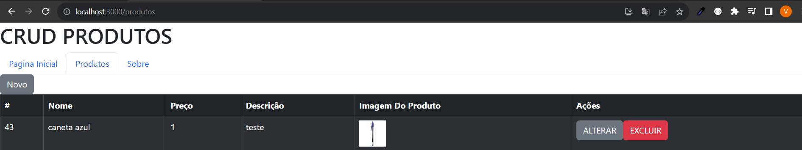
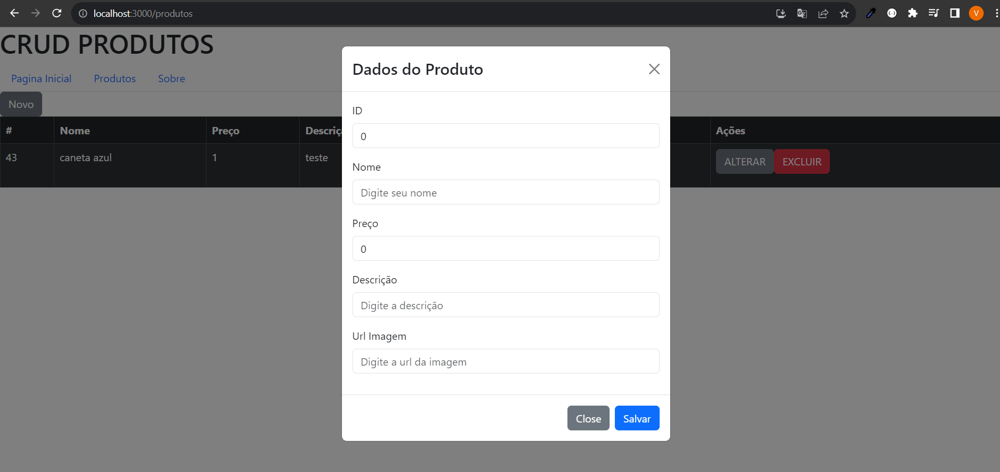
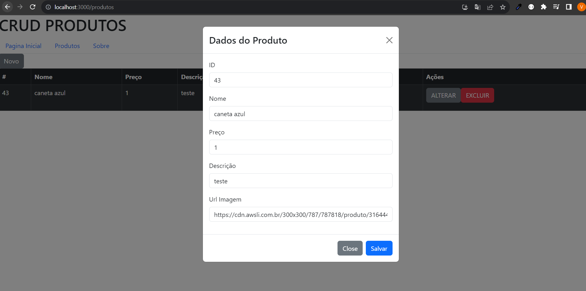

# PROJETO
Sistema de Perguntas e Respostas 

# COMO INSTALAR PROJETO 
- Clone o Projeto

### BACK END
- Crie um banco SQL e veja as configs em rest-api-produtos/src/main/java/database/RepositorioProduto.java
- E rode o backeand na sua maquina

### FRONT END
- Instale o node.js
- Abra o terminal e de um NPM INSTALL para instalar dependencias do react

# IMAGENS DO PROJETO
## LISTAGEM PRODUTOS

## ADICIONAR PRODUTO

## ALTERAR PRODUTO

# TECNOLOGIAS USADAS
- REACT
- JAVA
- SPRING
- SQL